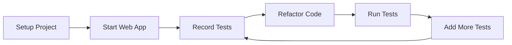

# 🎭 Playwright Demo Project - Complete Setup

## 📋 What You've Got

This project demonstrates **Playwright test recording and playback** with a comprehensive .NET Core web application and test suite.

### 🏗️ Project Structure
```
PlaywrightDemo/
├── PlaywrightDemo.sln                    # Solution file
├── README.md                             # Comprehensive documentation  
├── RECORDING-TUTORIAL.md                 # Step-by-step recording guide
├── quickstart.ps1                        # Automated setup script
├── 
├── PlaywrightDemo.WebApp/                # Demo Web Application
│   ├── Pages/
│   │   ├── Index.cshtml                  # Home page with navigation cards
│   │   ├── Contact.cshtml                # Contact form with validation
│   │   ├── Products.cshtml               # Product catalog with search/filter
│   │   ├── Interactive.cshtml            # Modals, drag-drop, dynamic content
│   │   └── Register.cshtml               # Multi-step registration form
│   └── (Page models and program files)
│
└── PlaywrightDemo.Tests/                 # Playwright Test Project
    ├── PlaywrightTestBase.cs             # Base test class with helpers
    ├── ContactFormTests.cs               # Contact form test scenarios
    ├── ProductCatalogTests.cs            # Product catalog test scenarios
    ├── InteractiveElementsTests.cs       # Interactive UI element tests
    └── playwright.config.json            # Test configuration
```

## 🚀 Quick Start (3 Minutes)

### 1. Setup Everything
```powershell
.\quickstart.ps1 setup
```
This will:
- Build the solution
- Install Playwright browsers
- Prepare everything for testing

### 2. Start the Web App
```powershell
# Terminal 1
.\quickstart.ps1 run-app
```
Web app will start at `https://localhost:7294`

### 3. Run Tests
```powershell
# Terminal 2  
.\quickstart.ps1 run-tests
```

### 4. Record New Tests
```powershell
# Terminal 3
.\quickstart.ps1 record
```

## 🎯 Demo Features

### Web Application Pages

| Page | URL | Testing Focus |
|------|-----|---------------|
| **Home** | `/` | Navigation, basic interactions |
| **Contact** | `/Contact` | Forms, validation, submission |
| **Products** | `/Products` | Search, filtering, cart operations |
| **Interactive** | `/Interactive` | Modals, drag-drop, dynamic content |
| **Register** | `/Register` | Multi-step forms, complex inputs |

### Test Scenarios Included

✅ **Contact Form Tests**
- Form validation for required fields
- Text input, email, dropdown, textarea
- Checkbox interactions
- Form submission and success messages

✅ **Product Catalog Tests**  
- Product search functionality
- Category filtering
- Add to cart operations
- Cart count updates and clearing

✅ **Interactive Element Tests**
- Modal dialog interactions
- JavaScript alert handling
- Range sliders, color pickers, date inputs
- Tab navigation
- Drag and drop functionality
- Dynamic content loading

## 🎬 Recording Workflow

### Quick Recording Example
1. **Start recording**: `.\quickstart.ps1 record`
2. **Navigate**: Click "Go to Contact Form"
3. **Interact**: Fill out the form
4. **Submit**: Click "Send Message"
5. **Verify**: Check success message appears
6. **Copy code**: From Playwright Inspector to your test file

### Generated Code Example
```csharp
[Test]
public async Task RecordedContactFormTest()
{
    // Navigate to contact page
    await NavigateToPageAsync("Contact");
    
    // Fill form (recorded actions)
    await Page.FillAsync("[data-testid='first-name']", "John");
    await Page.FillAsync("[data-testid='last-name']", "Doe");
    await Page.FillAsync("[data-testid='email']", "john@example.com");
    await Page.ClickAsync("[data-testid='submit-button']");
    
    // Verify result
    await Expect(Page.Locator("[data-testid='success-message']")).ToBeVisibleAsync();
}
```

## 🔧 Key Features for Testing

### Data-TestId Attributes
Every interactive element has `data-testid` attributes for reliable test automation:
```html
<input data-testid="first-name" ... />
<button data-testid="submit-button" ... />
<div data-testid="success-message" ... />
```

### Test-Friendly UI Elements
- **Forms**: Contact, registration with validation
- **Search & Filter**: Product catalog with dynamic results
- **Interactive Components**: Modals, tabs, drag-drop
- **Dynamic Content**: Cart updates, content loading
- **Multiple Input Types**: Text, email, date, color, range, checkboxes

### Browser Support
- ✅ Chromium/Chrome
- ✅ Firefox  
- ✅ WebKit/Safari

## 📖 Documentation

| File | Purpose |
|------|---------|
| `README.md` | Complete documentation and best practices |
| `RECORDING-TUTORIAL.md` | Step-by-step recording tutorial |
| `quickstart.ps1` | Automated setup and run scripts |

## 🎯 Learning Objectives

By using this demo, you'll learn:

1. **Test Recording**: How to record user interactions
2. **Test Playback**: Running recorded tests reliably  
3. **Element Selection**: Using data-testid and robust selectors
4. **Assertions**: Verifying UI state and content
5. **Test Organization**: Structuring tests and base classes
6. **Best Practices**: Maintainable and reliable test code

## 🔄 Workflow Summary



## 📞 Next Steps

1. **Explore the web app** - Visit each page and try different interactions
2. **Record your first test** - Use the recording tutorial
3. **Run existing tests** - See how they work
4. **Add new scenarios** - Extend the test coverage
5. **Refactor and organize** - Apply best practices

## 🆘 Troubleshooting

### Common Issues
- **Port conflicts**: Web app uses https://localhost:7294
- **Browser installation**: Run setup if browsers missing
- **Test failures**: Ensure web app is running during tests

### Getting Help
- Check `README.md` for detailed documentation
- See `RECORDING-TUTORIAL.md` for recording help
- All test elements have `data-testid` for reliable selection

## 🎉 You're Ready!

This project gives you everything needed to understand Playwright test recording and automation. Start with the quickstart script and explore the comprehensive examples provided.

**Happy Testing!** 🎭
